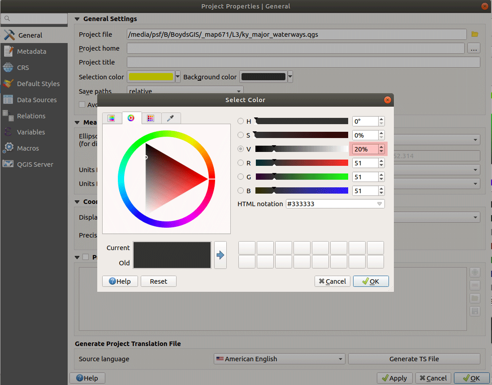
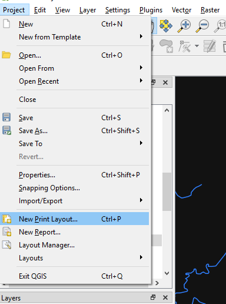
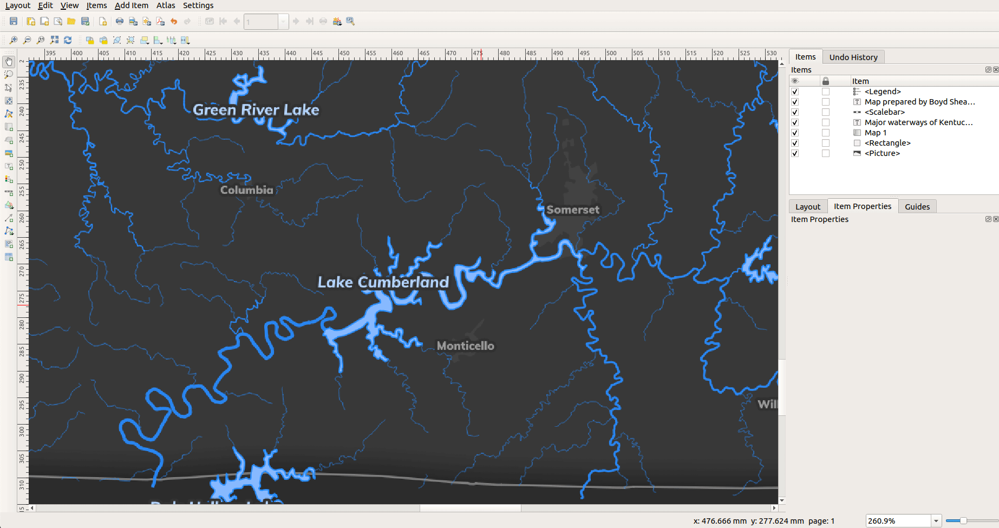

# Lesson 03: Creating Map Layouts in QGIS

## Table of Contents

<!-- TOC -->

- [Lesson 03: Creating Map Layouts in QGIS](#lesson-03-creating-map-layouts-in-qgis)
    - [Table of Contents](#table-of-contents)
    - [Overview](#overview)
    - [Data files](#data-files)
    - [Creating a thematic map in QGIS](#creating-a-thematic-map-in-qgis)
        - [Styling the map and vector features](#styling-the-map-and-vector-features)
        - [Data type and Level of Measurement](#data-type-and-level-of-measurement)
        - [Classify and symbolize ordinal data](#classify-and-symbolize-ordinal-data)
            - [Save Layer Style Files for reuse in other projects and datasets](#save-layer-style-files-for-reuse-in-other-projects-and-datasets)
        - [Panning and zooming your styled map](#panning-and-zooming-your-styled-map)
    - [QGIS Print Layout to export a finished map](#qgis-print-layout-to-export-a-finished-map)
        - [Adding map element to the layout](#adding-map-element-to-the-layout)
        - [Adding a title, legend, and theme](#adding-a-title-legend-and-theme)
    - [Adding feature labels](#adding-feature-labels)
    - [Adding a background image in Layout](#adding-a-background-image-in-layout)
    - [Exporting the map](#exporting-the-map)
    - [Publish static map to web page](#publish-static-map-to-web-page)
        - [Introduction to basic HTML and CSS](#introduction-to-basic-html-and-css)
            - [image element](#image-element)
            - [hyperlink element](#hyperlink-element)
            - [Cascading Style Stylesheets (CSS)](#cascading-style-stylesheets-css)
    - [Resources and references](#resources-and-references)

<!-- /TOC -->

## Overview

Within this lesson you will:

* Gain applied understanding of map making
* Practice opening a variety of geographic data with QGIS and viewing their attributes within QGIS
* Perform basic map styling for different data types
* Create a thematic map showing order of stream network
* Create and export a map layout as a static image file
* Publish a web page that displays the map at two resolutions
* Manipulate basic HTML elements and CSS style rules to change the appearance of your web page

## Data files

Use the layers you created in the last lesson. The should be available from your PostGIS database or from the GeoJSONs you created. Please don't add duplicate copies of GeoJSONs to work on this module.


## Creating a thematic map in QGIS

We'll continue with the last lesson and use fundamental cartographic techniques to make a map of Kentucky's major waterways. We'll prepare the map for export using the QGIS 3 Print Layout. You should make sure the CRS is the appropriate local coordinate system, e.g., in Kentucky we would use "EPSG: 3089".

Continuing from the steps in the previous lesson, open the QGIS project you saved in the *module-02/lesson-map/* folder. **Save** your QGIS project in the *module-03/lesson-map/* folder now and save often!

You should have four layers in the proper CRS as shown here:

    
*Kentucky map in proper coordinate system and ready to style*

A **thematic map** has a theme and attempts to show the pattern of geographic features in an area. We want to show the pattern of waterbodies and streams in our state; where larger streams exist, we want to emphasize those features. We will vary the width of a stream based on its attribute value for stream order. A **reference map** is used for navigation and shows many different features to help locate you in an area. Topographic maps are nice examples. While one could use our stream map to navigate, they would likely not enjoy this task.

When we are finished with our design, we might have a layout that evokes the character of waterways in your state. We can use photography, color, font choices, and layering to accentuate the theme of the map. Notice in the below example, the waterways are brightly colored against a dark gray state polygon and a background photograph fills the entire frame. This was done entirely in QGIS and represents one creative direction you might take.

    
*Example of a finished map layout*

### Styling the map and vector features

Let's now cover some basics of styling in QGIS.

QGIS adds layers to the **Layers Panel** in the order in which you import them and renders them in the map canvas starting at the bottom of the **Layers**. Depending on the order in which you add your data files, this can result in some layers obscuring others. We want our layers arranged so that state outline renders first, then urban areas, streams and finally waterbodies. Drag and sort each layer to achieve this layering order.

Next, let's set the **Map Canvas** background color. Let's experiment with light on dark color scheme. Go to **QGIS menu > Project > Properties...**. Select the **General** tab. Change the **Background color** to 5%-25% black using the **Select Color** selector. Avoid using solid black on any element except text.

    
*Select Color picker to modify color*

QGIS selects a random color for each layer as you import them. To change a layer's color, right-click on the layer's name in the **Layers Panel** (just double-click the layer), in this case *ky_state*, and select **Properties**. Select **Symbology** tab and **Simple fill** and make the polygon fill color a little less lighter than the background and the outline a lot lighter, but not 100% white. Let's try to build up colors and make a subtle luminous effect. Experiment with other settings, such as outline width and join style (beveled vs round corners).

  
*QGIS layer preferences window selecting the Symbology tab*

Find the **Draw effects** toggle box and click it. Here you can add effects like drop shadows and glows to each feature in the layer. If the layer contains a lot of features, this could get expensive to draw. Since we only have two polygon features for Kentucky, it should draw quickly. Select the **Inner Glow** for the dropdown menu and change **Blend mode > Multiple**.

  
*Apply effects to layer features*


Next, let's style the *ky_urbanareas* layer. We'll remove the polygon outlines with the "No Pen" setting and give the layer some transparency to blend the with the background. Since this is a map about waterways, our urban layer should be "just a whisper." Consult this style setting:

  
*QGIS layer preferences window changing urban areas*

### Data type and Level of Measurement

Sometimes we encounter a layer's attribute table with a column that encode numbers as a _TEXT_ data type. This might make sense if our data is a rank, or ordinal, data type. The Strahler stream order is a ranking of streams on a network. Stream order of "2" is not twice as large as the stream order of "1", it just higher on the network. This type of attribute could be encoded as a _TEXT_ or _NUMERIC_ data type.

Other times a column might have numbers as a _NUMERIC_ data type but they do not represent a quantity, for example, consider zip codes.  Some numbers should should allows be encoded as _TEXT_ data types, e.g., any number that might start with a 0, such FIPS and GEOID values, the [Geographic Identifiers used by the Census Bureau](https://www.census.gov/geo/reference/geoidentifiers.html). We will explore how to convert data types 'on the fly' in QGIS in the next lesson, though we discovered how to CAST data types in the last lesson.

This distinction between difference of category versus difference of quantity is important and guides how we classify and symbolize data. We call this distinction the **Level of Measurement** of our data. We have three basic types we encounter in mapping:

* **Nominal data** are unordered, categorical values. Place names and zip codes are great examples. Our symbology needs to avoid showing any preference or rank to our data.
* **Ordinal data** are ordered, categorical values. The stream order is our current example, but values like "good, better, and best" are ordinal data types. Our symbology can show preference or rank to our data.
* **Numerical data** are values of magnitude and also known as quantitive data. Examples are elevation, air temperature, population count, and area. Our symbology can rank our data but we might need to normalize our values. For example, if we show acres of hay production by county, bigger counties will always have more acres of hay. Maybe it would be better to show what percentage of the county is growing hay? This is topic of our next lesson.

Different data types require different symbology schemes. Generally, we want don't want to imply rank in our data unless it is ordinal or numerical. We call these **graduated or sequential** schemes. Making streams wider as they get higher in stream order is a graduated size symbol. Increasing the color darkness or intensity of a feature as it gets higher in rank is a graduated color symbol. Read more about [using colors on thematic maps](http://axismaps.github.io/thematic-cartography/articles/color_schemes.html).

### Classify and symbolize ordinal data

The stream layer has an ordinal attribute that help visualize the network of major waterways, *stream_order*. The numbers indicate rank of streams on a network, the higher the number, the more branches up stream. In the layer's **Symbology** tab, select the method of symbology as **Categorized** with the column providing the categories as *stream_order*. While these are numbers, they only indicate rank and not magnitude. Click each symbol and change its color to **#2f7fff** (this is [hexadecimal color value](http://www.w3schools.com/colors/colors_picker.asp) commonly used in web mapping applications) and make the line width increasingly thicker with higher rank. Let's say from 0.1 mm to 1.5 mm is the range of widths, though, feel free to experiment with these values.

  
*QGIS Style preferences for symbolizing streams by an attribute category*

You can remove negative Strahler stream order values by clicking off the check box for those symbols. Check your metadata and map to see what those values indicate and if any features have those values.

#### Save Layer Style Files for reuse in other projects and datasets

Since we've made a custom style, let's save the style. Click on the **Style** drop-down menu and **Save Style...**. This will bring up the _Save Layer Style_ dialog box.

- **Save style:** _As QGIS QML style file_
- **File**
  - **Name:** *stream_style_by_order.qml*
  - **Location:** Your repo's *lesson-map* folder.
- **Categories:** Check all options

    

    
*Saving Style preferences for layers as a text file*

This produces a text file that can used in other QGIS projects if that project has data with the same attributes. To use it again, click on the **Style** drop-down menu and **Load Style...** to apply the style to a different state.

Now, we'll arrange our layers in the correct draw order. Normally, the draw order is based on geometry type. A polygon should draw first (be at the bottom of the layer stack), lines draw second (be in the middle of the stack), and points last (at the top of the stack). Streams and waterbodies are a unique exception to this rule. If we arranged stream lines over waterbody polygons, the waterbodies would have a line snaking across the polygons (if the line and polygon were different colors and typically waterbody outline and fill are different colors). In our case, let's click-drag our layers in the order that looks the best.

on the *ky_waterbodies* layer. First, if it isn't already, make sure *ky_waterbodies* is below *ky_streams*. If it is not, left-click and drag it below *ky_streams* in the **Layers** panel.

    
*Changing layer order*

Open the **Symbology** for *ky_waterbodies* and make the polygon outline the same color as your streams and the polygon fill a little lighter than the outline color, which is a traditional cartographic convention. Applying the color blue to water features is long standing convention and intuitive for most viewers. Many mappers make use of [ColorBrewer](http://colorbrewer2.org/) to help them make good decisions when intuitive choices aren't obvious.

  
*Style the waterbody polygons*

### Panning and zooming your styled map

Let's evaluate our styles by setting our scale and inspecting our line widths. The line widths we selected are in millimeter units and are the same regardless of the scale of the map. You might have noticed in the **Symbology** tab we could make our style units in map units, i.e., feet, but takes more experimentation to make look good. However, if you can use map units effectively it makes finishing a layout faster.

So we know our data is optimized for 1:1,000,000-scale maps. Let's set our scale to that value in QGIS scale menu and then **Lock** it:

  
*Set Map Canvas scale*

Use the **Magnifier** to zoom to 400%, which is about the maximum resolution a viewer can see on a printed page. It is also the maximum zoom level for high-resolution Geospatial PDF or GeoTIFF maps. In this next section we'll set our page size to accommodate a 1:1,000,000 map of Kentucky.

How does your line work look? I think my initial widths were too generous for the higher order streams. Revisit any layers' styles and change to new settings. It's always good to save the style to new text Layer Style File, too. We find one you like, you can delete the other Style Files.

If you get lost panning and zooming, we have a few ways to recenter our map. The easiest way is to right-click a layer that is the minimum extent of our desired area and **Zoom to layer**. This will change your **Scale** so you'll need to reset that value. The **Spatial Bookmarks Panel** will save desired zoom/pan views as convenient bookmarks that exported and imported in other projects:

    
_Using spatial bookmarks to set desired views in QGIS Map Canvas_

This is enough on styling for now. Let's move on to consider how to get this thematic map out of QGIS.

## QGIS Print Layout to export a finished map

We'll be using the Print Layout to prepare our map for export or print. Consult the QGIS [Print Layout](https://docs.qgis.org/testing/en/docs/user_manual/print_composer/index.html) documentation for more details and explanation.

Next, open up the QGIS Print Layout. This is where we'll layout our map and add the necessary map elements, like titles, a legend, scale, etc. To open Print Composer, go to **Project** in the top menu bar, then **New Print Layout...**. You'll be asked to name this session. Call it "Kentucky Streams".

  
_QGIS main window opening new Print Layout_

Print Layout offers a lot of options for laying out your map, we'll go through a few of the basic features.

### Adding map element to the layout

Let's now bring our map in by clicking the **Adds a new Map to the layout** icon  on the far left (or go to **Add Item > Add Map**. The cursor will turn into crosshairs. Click and drag the cursor to draw a box. Starting at the top left corner of the white workspace, drag a box in which to place the map. You can change the size of the box once it's been created by dragging the sides.

Right-click anywhere in your map layout and select **Page Properties**. This will open up the _Item Properties_ panel where you can adjust the page size and background color.  

  
*Resize layout and change properties*

Next, click on the map in our layout. select he **Item properties** tab, verify the scale is 1:1,000,000, and change it if not. You might also need to click **Update preview**. Use the **Move item content**  tool to center your map in its frame. A lot of options are available here to make a nice cartographic output, such as **Grids** and **Overviews**.

    
*Setting map item properties*

Once you've got it centered and scaled to your liking, check the box next to **Lock layers for map item** from within the  **Item Properties** panel.

### Adding a title, legend, and theme

Now we'll add some basic map elements. To add a title, select the **Adds a new Label to the layout** button . Drop and drag a new text box to add a title to your map. Give your map a meaningful title. Good map titles typically explain the what, where, when of the geography being depicted (you may have to consult the metadata for this information). For instance, in this case we'll write a title "Major waterways of Kentucky."

Using the **Item Properties** options on the right side of the screen, you can change the content of the text box as well as alter the font. You'll want to choose a large font size for the text, for example,

  
*A formatted title added to the map*

Now use the *Add new label* to include such additional information as descriptions of the data, author name and date, and metadata information. Look in a layer's metadata for citation information. Provide the following:

* Your name and title, e.g., "The Map Doctor @ New Maps Plus!"
* Date of publication
* Software used to make map, e.g., QGIS 3.6 and macOS 10.14
* Data source. In our case it is "National Atlas of the United States, 1:1,000,000-Scale datasets.
March, 2016, 2nd Edition."
* Any other relevant information you think the viewer would like to know. 

Next add a legend by clicking on the **Adds a new Legend to the layout** icon  and clicking and dragging in the space where you want the legend. In the **Item Properties** menu, unclick **Auto Update** under Legend Items and scroll down enough to see the menu bar below the list of legend items. To remove items from the legend we don't need, click on the item and then the **negative** icon. Adjust the background and font color to match your theme.

  
*Adjusting the legend*

Let's add a scale bar by clicking the **Adds a new Scale Bar to the layout** icon  and clicking and dragging in the space where you want the scale bar. Set the Scalebar units to "Miles" in the scale bar **Item properties**. Again, change the font and color to match your theme:

  
*Adjusting the scale bar*

There are a number of other map elements that can be added through the Print Layout interface including directional arrows, rendered HTML from other websites, and additional graphics. Play around with the settings and see what you can create. Again, consult the [QGIS documentation site](https://docs.qgis.org/testing/en/docs/user_manual/print_composer/index.html).

## Adding feature labels

After you finish your layout, we can now think about feature labels. QGIS has a label-placing algorithm that automatically puts labels a layer's features. However, we need to select a scale before we place labels. In Map Canvas, the labels are always the same size regardless of scale, so it is difficult to gauge how your labels will look until the scale is finalized. We are publishing our map at 1:1,000,000.

Go back to Map Canvas and select the *ky_waterbodies* layer, click the button to open the **Layer Styling panel**, and the select **Rule-based labeling**. We could use normal labeling via **Single labels**, but we want to limit labels to only the largest waterbodies. Finally, click the **Add new rule** button.

    
*Creating rule-based labels for our waterbodies*

When we exported the waterbodies, we kept an attribute called *area_sq_mi*, which is the surface area of the lake or waterbody. Our layer contains many small waterbodies that we don't need to label. In the rule that you just created, apply a filter statement: 


```sql
 "area_sq_mi" > 8 
```


The value could be different, depending on the scale of your map. Explore different values and see how the labeling changes. Also, watch the instructional video to see how you can interactively discover feature attributes. Click **Test**, 

    
*Filtering features to label*

Let's change the style of our label. Make sure you select the correct attribute to use for the label, **name**, use  an italicized font, and make the color the same as the waterbody fill color (or slightly lighter).

    
*Waterbody label style*

After this step, you might notice that the labels might disappear into the waterbody polygons. We need to draw a glow or buffer around the text to provide clean separation from the background. Click the **Buffer** tab and apply a very dark color. 

    
*Adding a text buffer to feature label*

Experiment more and try to label the urban areas using **Single labels**. Keep your scale at 1:1,000,000 to make sure you get an accurate preview of label placement. Periodically switch over to Layout and view your label placement there.

    
*Checking label placement in Layout*

## Adding a background image in Layout

Can you find or make a photograph of a Kentucky waterway? This image was photographed over Cave Run Lake in eastern Kentucky. 

   
*Download aerial photograph of [Cave Run Lake](graphics/__aerial-img.jpg)*

Obviously, if we placed this as an image, we would need to reduce the opacity and change the blending mode so that it doesn't distract from the map layers. Click on the **Add picture to layout button**.

   
*Add picture to layout*

You'll be presented a cursor to draw the extent that your image will cover. Make a box that covers the entire page. In the **Item properties** tab, find **Main Properties > Image source**. Find the image the in *graphics* folder in the repository , *graphics/__aerial-img.jpg*. 

   
*Add image source to layout*

After the image appears, it will be the top layer. In the Layout menu, find **Items > Send to back** to make the image the true background. OK, so that's kinda cool, but I can't read the text! (If the image looks like it's behind the map frame, you need to disable the **Map > Item Properties > Background** property.) 

In your **Picture > Item Properties > Rendering** properties, change the **Blending mode** to **Overlay**. Adjust the opacity so that you can read the text easily, but still can make out the image as a picture of water.

   
*Change blending mode for background image*

Adding effects is always optional and takes work to look right. If the effect is more of a distraction, then consider not using it. A map's aesthetic is a charged area of discussion and disagreement. As a general rule, less is more in mapping and while you might not say that a map looks great, you know when one looks bad.

## Exporting the map

QGIS gives us a couple of options for exporting the map. Go to **Layout** in the top menu bar. In the dropdown menu you'll see that you have the option to **Export as Image...** (from which you have a variety of image formats to choose from), Export as PDF, and Export as SVG. Click the **PNG format** (Portable Network Graphics [file format](https://en.wikipedia.org/wiki/Image_file_formats#PNG)) and export two sizes:

* Make a PNG at 1200 px wide
* Make a PNG at 8000 px wide


_Set the width of the exported image_

Give appropriate names for those images (use alphanumeric characters, no spaces, and give hint of content, e.g., Kentucky_waterways_1200px.png) and add them to the *lesson-map/graphics* folder.

If we enable the **Save world file** in our **Layout Properties** > **Export Settings**, we can export raster data that is georeferenced and useable in other GIS apps, including QGIS. So, you can make finished maps to print or new layers to use in another GIS project.


    
*Example of a finished map layout*

You may find Composer is limited for producing the quality of the static map you're looking for, but it is remarkably flexible. Keep exploring! You can easily open a PDF export in an application like Adobe's Illustrator and Photoshop, or the open-source [Inkscape vector drawing program](https://inkscape.org/en/) for further refinement.

Finally, don't forget to **Save** your work. If you've done the minimum, your final GIS project space should have the following files: _.qgz_, _.qml_, and two _.png_. The data will either be _.geojson_ in the prior lesson's directory or PostGIS layers hosted on your local computer. That's it: slim, trim, nice, and clean!

## Publish static map to web page

Open your Atom editor and open the repository folder. In Atom, find the starter web page located at *lesson-map/index.html*. We'll use this basic template within this lesson.

While you could open this _index.html_ file directly in your web browser by double-clicking on the file, we're going to take advantage of the **web server** capabilities within Atom. Instead of just reading the contents of the file, we want our browser to make what's known as an "HTTP request" for the file, and for that file to be "served" back to the browser with a response.

Web pages get delivered to your browser because a remote (vs. local) web server "handles" your request. Read more about [What is a web server?](https://developer.mozilla.org/en-US/Learn/What_is_a_web_server).

The important thing to understand is the difference between our web browser reading the file from a location on our hard drive (e.g., _file://Users/Documents/map671-module-03-tastyfreeze/lesson-map/index.html_) and our browser making this HTTP request from a local web server. We want to use the latter when doing web map development, and Atom provides this local web server for us.

* As we saw in the last lesson, to launch a local web server, select **Command Palette -> Live Server: Open with Live Server** or use the button in your text editors status bar.

Your document will open in your web browser using a local web server. Note that the URL in the browser is not a relative path to a location on the computer (i.e., _:///Users/Documents/..._), but rather it's a URL that looks like _<http://127.0.0.1:50090/lesson-map/index.html>_. Pay attention throughout this course and make sure you see this _<http://127.0.0.1/>_ within your URL when testing your application. Otherwise, the web document will not load external files or render correctly.

Note that we currently have a visually underwhelming web page. Let's add the static map using HTML.

### Introduction to basic HTML and CSS

While we'll work with web technologies more extensively in the following courses, let's introduce their basic components so we can host on static maps with other information. HTML, an acronym for HyperText Markup Language, comprises the basic building blocks of a web page. It is not a programming language, per se. Rather, it is a "markup language" used to structure and describe content (e.g., text, images, audio, video, etc.). To do so, it uses a set of elements to define various content types (e.g., a heading, paragraph, or list). We've used a markup language with Markdown.

We write HTML elements using "tags" that contain the content, and we enclose these HTML tags using angled brackets. The closing tag begins with a forward slash. For example, the division element is a common way to divide an HTML page into discrete containers and uses the following open and closing tags: `<div></div>` Some tags like the image element `` are self-closing tags and don't use a closing tag, e.g., `</img>` is not defined nor needed.

Let's look at our minimal HTML document and consider the tags within it.

```html
<!DOCTYPE html>
<html>

<head>
    <meta charset=utf-8 />
    <title>Web Page Template</title>
    <meta name='viewport' content='initial-scale=1,maximum-scale=1,user-scalable=no' />

    <style>

    /* This is a comment. CSS rules written here */

    </style>
</head>

<body>

	<!-- This is a comment. Content inside the <body></body> is rendered by browser -->

    <h1>My Awesome map!</h1>

</body>

</html>
```

Very briefly:

* The first line of the document tells web browsers which version of HTML the document contains (this is HTML5, the latest specification).
* After that, the entire document is enclosed within the two `<html></html>` tags.
* Content enclosed between the `<head></head>` tags is not displayed in the rendered web page. The `<head>` element contains metadata about the document, including its title, links to external resources (such as fonts and JavaScript scripts), search engine optimization keywords, and style rules. Note that it is important to write a meaningful title for your document between the `<title></title>` tags. This is what a search engine would display in a list of search results.
* The `<body></body>` tags contain all the elements that may appear visually on the web page, and may contain additional scripts that are not rendered for the user but still affect the web page.
* Notice how comments are formatted in various locations in the page. Comments inside the CSS rules (Cascading Style Sheets) uses `/* comment */` whereas comments between HTML tags uses `<!-- comment  -->`.

Let's return to our _index.html_ template page to write more HTML content within these `<body></body>` tags, beneath our `<h1></h1>` tags. Here we'll cover only a few of the more commonly used HTML tags here. You'll want to consult additional resources, such as the Mozilla Developer Network's [HTML element reference](https://developer.mozilla.org/en-US/docs/Web/HTML/Element). Other useful resources include:

- the [w3schools HTML(5) Tutorial](http://www.w3schools.com/html/default.asp)
- searching for answers on [stackoverflow](http://stackoverflow.com/)

#### image element

An image is an external resource that we need to reference with a URL in our HTML document. The [image element has attributes](https://www.w3schools.com/tags/tag_img.asp) that we can define inside the tag.

Within your open _index.html_ file, replace the text `<!-- Add your custom HTML here -->` with the following line of HTML:

```

```

The `` tag tells the browser to render an image and the `src` attribute describes where the image is located with a path name. In the case, the source property is looking for the PNG called _Kentucky_waterways_1200px.png_ in the _graphics_ folder relative to the _index.html_ file.

This particular URL path is a **relative path**. That is, it navigates through the file/directory structure from the current location of the _index.html_ file. If we want to go down a directory, we spell out the path name, e.g., `path/to/file.png` goes down two folders to find the file. If we want to go up a directory, we use `../`, e.g., `../path/file.png` goes up one folder and then into another to find the file.

An **absolute path** or **full path** points to the same location in the directory regardless where it is called. An absolute path name starts with a `/` e.g., `/path/to/file.png` goes to the top-most directory, the root, to find the file. In Atom, you can find the full path by right-clicking a file and selecting **Copy Full Path**. This will locate the file in your hard drive, but only your hard drive. Avoid absolute paths when building web pages.


Okay, let's continue. Atom live-server will likely update the web page automatically as you save changes (if not, refresh your browser page to see the updates).

The image element `alt` attribute defines an alternate text block that is used if the browser can't render the image (e.g., broken URL) and by search engine indexing.

Notice the pattern in writing an HTML tag:
`<self-closing-tag attribute1="property" attribute2="property">`. With a little research for each tag, you can begin to explore how to manipulate HTML elements on your page.

#### hyperlink element

Let's now look at adding hyperlinks to external resources using the `<a></a>` tag. In our case we have two versions of our map; we display the small resolution map on our page and then give the user a option to find a large resolution image. This setup prevents serving large file sizes over the web unless they are directly requested.

Let's add a link to the higher resolution map below the image:

```

<br> <!-- line break tag -->
<a href="graphics/Kentucky_waterways_8000px.png">Link to high resolution map</a>
```

Notice that we use the `href` attribute to define URL as a relative path to the resource. The content that is between the `<a></a>` tag is render as a hyperlink in the document. Here we are using text, but we could insert the image element between the tags instead.

#### Cascading Style Stylesheets (CSS)

We'll can style our HTML elements with CSS, a stylesheet language which describes the presentation of HTML. We write CSS as a series of style rules. We'll more explore these rules in much detail in the future.

Look in our HTML document between two `<style></style>` tags enclosed within the head element at the top of the document. We'll primarily be writing style rules inside these tags in our document for simplicity.

CSS is a powerful technology, but difficult to master. It works by first **selecting** an HTML element (or defining a new class) and then declaring various **property** values.

This graphic from the [w3schools](http://www.w3schools.com/css/css_syntax.asp) is useful for understanding the syntax of a CSS rule.

       
Figure 18. CSS Syntax

Look in the `<style></style>` area in the *lesson-map/index.html* page and find the following style rules:

```
section {
	width: 960px;
	/* width: 80%; */
	margin: 20px auto;
}
```

The rule applies to all [section elements](https://www.w3schools.com/tags/tag_section.asp) as defined by the `<section></section>` tag. The `width` property defines the width of the section as 960 pixels wide, a standard desktop browser width but not mobile friendly.

The `margin` property gives space outside the section element, which can be considered a rectangle or box in the layout. (Read about the [CSS box model](https://www.w3schools.com/css/css_boxmodel.asp).) The `margin` syntax is a little tricky:

```
/* Add outside space in the following order:
margin: top right bottom left; */

/* Provides 10px around all sides */
margin: 10px 10px 10px 10px;

/* This is equivalent to the above rule */
margin: 10px;

/* 20px space on top and bottom sides and 10px on left and right sides */
margin: 20px 10px;

/* 20px space on top and bottom sides
but the space on the left and right sides are evenly filled automatically, which centers the element. */
margin: 20px auto;
```

To summarize, the `<section></section>` element, a box in our layout, is centered in our HTML `<body></body>` with an outside margin of 20 pixels on the top and bottom and is always 960 pixels wide. Let's use [relative CSS units](https://www.w3schools.com/cssref/css_units.asp) for our `width` property to accommodate deferent browser sizes. Swap the comments to make the `width` property 80%, which will fill the browser page to 80% of its display width:

```
section {
	/* width: 960px;*/
	width: 80%;
	margin: 20px auto;
}
```

Here we are styling all section elements. What if we wanted rules that worked on multiple elements. We have many ways to select elements using [CSS Selectors](https://www.w3schools.com/cssref/css_selectors.asp). We write a rule that is preceded with a period, `.` then we are creating CSS **class** that can be used on any element multiple times. If we write a rule preceded by a hashtag, `#` then we are defining a specific **id** than can be used on any element but only once.

For example the `#map` id used on a division element to define its look:

```
#map {
	width: 100%;
	margin: 10px auto;
	border: 2px solid #d3d3d3;
}
```

We'll discover this is important for creating an interactive web page as we saw in the first lesson. For now we'll just tinker with the rules to add a new look for our static map. Puzzle out the `border` property and see if you make a meaningful change on the page.

Now let's finish by creating a rule that makes our map fill the section element if the browser page is larger than 1,200 pixels wide. Find the `/* add custom style class here */` in style section and add the following CSS class rule:

```
.max-width-img {
	width:100%;
}
```

To use this rule in our image element, we need to add the `class` attribute to the tag and reference the correct CSS class name, `max-width-img`:

```

```


## Resources and references

* [Axis Maps Cartography Guide](http://www.axismaps.com/guide/)
* [Making Maps: DIY Cartography](https://makingmaps.net)
* [Color Brewer](http://colorbrewer2.org/)
* [Adobe Color CC](https://color.adobe.com/create/color-wheel/)
* [Adobe Typekit](https://practice.typekit.com)
* [Download or embed Google Fonts](https://fonts.google.com)
* [Ordinance Survey Stylesheets](https://www.ordnancesurvey.co.uk/resources/carto-design/cartographic-stylesheets.html)
* [w3 Schools HTML tutorial](https://www.w3schools.com/html/default.asp)
* [w3 Schools CSS tutorial](https://www.w3schools.com/css/default.asp)
* [Mozilla CSS reference](https://developer.mozilla.org/en-US/docs/Web/CSS)
