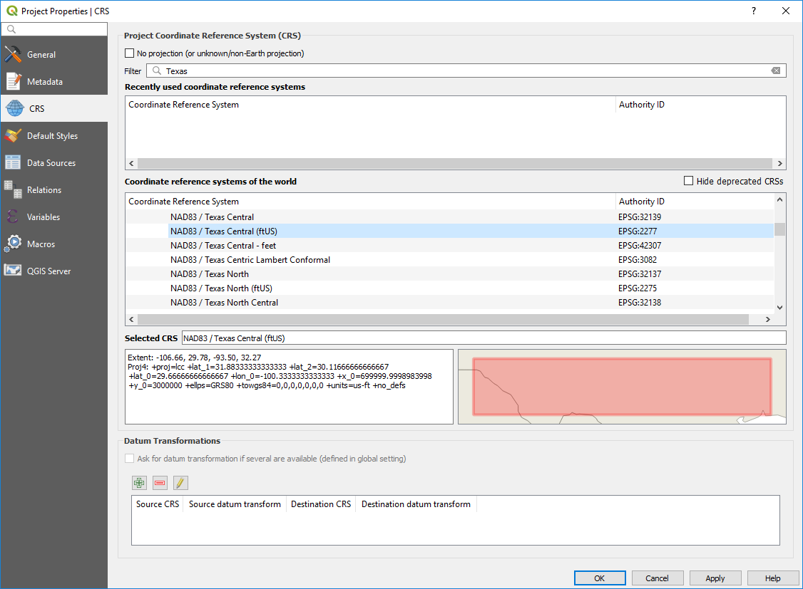
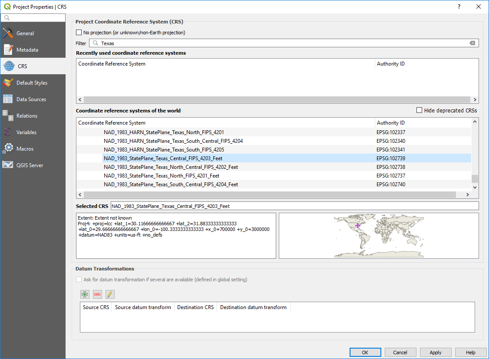
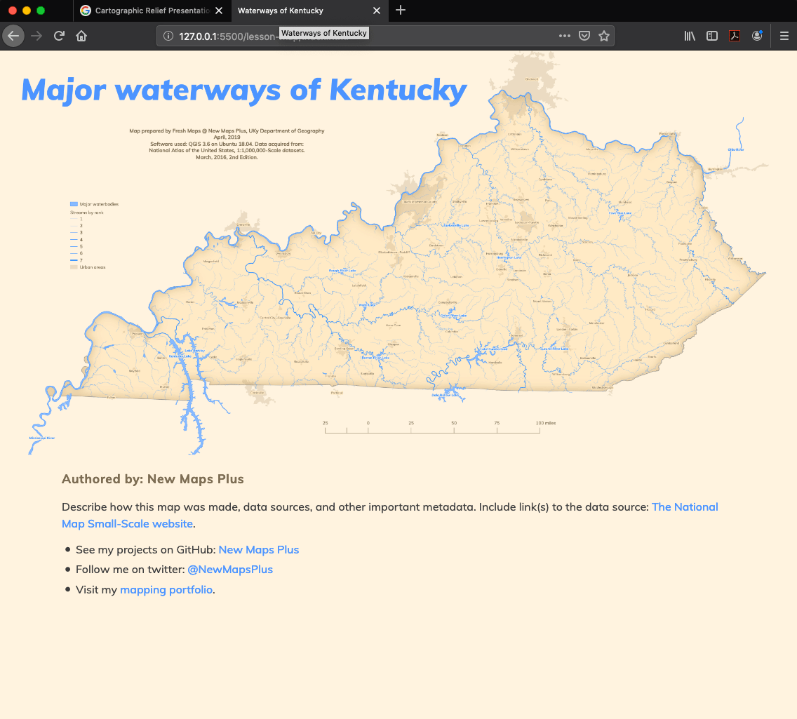
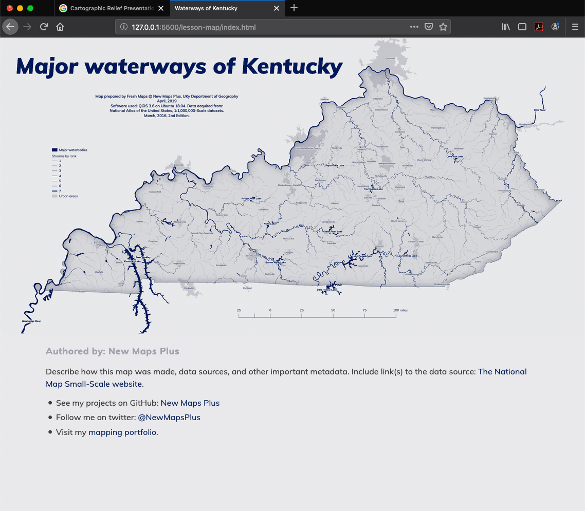

# Module 03 Lab Assignment

## Table of Contents

<!-- TOC -->

- [Module 03 Lab Assignment](#module-03-lab-assignment)
    - [Table of Contents](#table-of-contents)
    - [Overview](#overview)
    - [Data files](#data-files)
    - [Create a web page map of your home state waterways](#create-a-web-page-map-of-your-home-state-waterways)
        - [Required specifications of the deliverable](#required-specifications-of-the-deliverable)
        - [Submission](#submission)
    - [Examples](#examples)
    - [Challenge](#challenge)

<!-- /TOC -->

## Overview

Your contract with HydroTime has moved to phase two. They are interested in visualizing the stream networks in your hometown's state. Your contract specifies that you need to make a web page that shows the streams with an option to look at a high resolution version of the map.

The requirements of the map are listed below. You will submit all deliverables to the Canvas assignment page. All the tasks required to fulfill this assignment are documented within Module 03.

## Data files

Use the layers you created in the last lab. The should be available from your PostGIS database or from the GeoJSONs you created. Please don't add duplicate copies of GeoJSONs to work on this module.

## Create a web page map of your home state waterways

Apply the skills learned in the lesson to the data you created in the last module.

### Required specifications of the deliverable

1) The final map must fulfill the following requirements (6 pts)

* The map must display the full extent of state selected to map.
* Lakes must be shown and symbolized appropriately.
* Streams must be symbolized by stream order, where higher order streams have larger line widths.
* Urban areas need to be shown.
* The style of your map layers and layout are up to you, but please observe intuitive color schemes. Consult [using colors on thematic maps](http://axismaps.github.io/thematic-cartography/articles/color_schemes.html) and general guidelines with [ColorBrewer](http://colorbrewer2.org/).
* Map must have a meaningful title, an appropriate legend, and scale bar.
* Map page must include metadata information including the source and the projection information
* An appropriate coordinate reference system must used for the map and you'll need set it by going to **Project Properties > CRS ** or project each layer during a **Export > Save Features As..**. Finding an acceptable CRS for your state will take a little research (because many exist), but it is essential you know at least one. For mapping larger areas like continents, it is easier to select a CRS because we have a smaller but established set to use.

Changing coordinate reference systems is pretty easy. In your QGIS **Project Properties > CRS** you can search for the state you would like to map. For example, if you wanted to find an appropriate CRS for Texas, you can search QGIS for State Plane versions with NAD83 datum and US ft as units:

    
_Search for CRS for Texas in QGIS_

This selects a State Plane CRS (SPCS) for Central Texas using US feet as units. Each US state will have at least one SPCS and most states have multiple versions that are tuned to a specific region of the state. Pick one that gives a balanced representation for your state. These local CRS should always be used when making small-area maps. The goal is minimize map distortion so we can accurately display features. You could also use [UTM zones](https://en.wikipedia.org/wiki/Universal_Transverse_Mercator_coordinate_system) or even create your own projection with [Flex Projector](http://www.flexprojector.com/about.html).

Many CRS are nearly duplications. Notice the SPCS shown below has the projection parameters (though in slightly different order with slightly different values) but a different EPSG code, EPSG: 2277 (above) versus EPSG: 102738 (below).

    
Figure 2: Search for CRS for Texas in QGIS

Search [EPSG.io](https://epsg.io) and [SpatialReference.org](http://spatialreference.org/) for help understanding EPSG codes, which is the predominate way of specifying a CRS. If you need more background about selecting a CRS, please find the reading as PDF in the Canvas module.

2) The client has requested a web page that shows the map with link to a higher resolution version. This web page map must meet the following requirements (4 pts)

* Map needs to be in two resolutions: 1) width of 1,200 px and 2) width of 8,000 px
* Follow the lesson to learn how to format a web page.
* Map image format should be a PNG or JPG.
* A link must be available to access the higher resolution version.
* The web page must have must have a meaningful title (both in the header element and in the h1 element) and metadata about the author, data source, and brief description of purpose.
* Contact information in footer must be tuned to you, the author.
* The map web page must be called "index.html" in a folder called "waterways" in your *lab-03* folder.

### Submission

Paste the URL for completed lesson module within the Canvas, e.g., *https://github.com/newmapsplus/map671-module-03-username*

## Examples

If you work through the lesson example, you might have dark theme style like the following layout.

    
*Example web page with map from lesson*

Of course, you do not have to use this theme. If you want lighter backgrounds, then change the text color to create the appropriate contrast. You can also match the map background color to the `body` background property, creating a seamless image. Push matching map and HTML elements by using the same [Google Fonts](https://fonts.google.com) (fonts can downloaded and embedded) and colors.

    
*Example page with harmonized elements*

Notice that you can remove the page `h1` element since the title is on the map. Just make you add the map title to the `alt` property in the `img` element. Another design option is going monochromatic. In the below example I use shades of dark blue for all colors.

    
*Example monochromatic color scheme*

## Challenge

Experiment with color and create a different map and page color scheme. For example, use a color palette from a favorite photograph or start with a harmonic color picker, both of which can be found at the [Adobe Color website](https://color.adobe.com). The goal is not to make a flashy or loud design (after all, we're not designing sneakers). Instead, think about articulating your theme (major waterways in your state) in a neat and balanced layout that a viewer wants to explore. Maps contain a dense amount of information and require special graphical considerations to help viewers stay engaged.

Map design and color are perceived/appreciated differently by different viewers, and, ultimately, are [aesthetic choices](https://academic.oup.com/bjaesthetics/article-abstract/57/3/283/4259142?redirectedFrom=fulltext) made by the author. However, we can observe some basic guidelines to help prevent making poor choices. 
* Understand the components of color (hue, saturation, value or lightness), especially how they are used in cartography. Read Cynthia Brewer's article, [Color Use Guidelines for Data Representation](https://www.researchgate.net/publication/245692399_Color_Use_Guidelines_for_Data_Representation).
* Like stroke width or symbol shape, color is a [visual variable](https://www.axismaps.com/guide/general/visual-variables/). Generally, we vary a color hue to show differences of type, while varying color lightness and saturation to show differences of magnitude.
* Appreciate map color conventions and related [color symbolism](https://en.wikipedia.org/wiki/Color_symbolism). For example, blue has long been used for the color of water and rich reds to symbolize danger or significance.
* For base-colors, large areas of a single color (like a background), use muted and desaturated colors. Use vivid colors sparingly and for the main theme features. Too much vivid color on a map creates visual fatigue. 
* Use [color contrast](https://medium.muz.li/the-science-of-color-contrast-an-expert-designers-guide-33e84c41d156) and [theory](https://en.wikipedia.org/wiki/Color_theory#Warm_vs._cool_colors) to develop a strong [visual hierarchy](https://www.axismaps.com/guide/general/visual-hierarchy/) with good figure-ground separation. For example, using pure black only for text and recognizing that warm colors advance while cool colors recede.
* Finally, pick up an oversized art book and explore how artists use color. If you find a painting that you can stare at for hours, make note of its color scheme. Look for cartographers that hand draw and color their maps. We discovered [Erwin Raisz](https://www.davidrumsey.com/luna/servlet/view/search?sort=Pub_List_No_InitialSort%2CPub_Date%2CPub_List_No%2CSeries_No&q=+Raisz) in our first module. [Eduard Imhof](https://en.wikipedia.org/wiki/Eduard_Imhof), a Professor of Cartography in Zurich, Switzerland from 1925-1965,  is widely appreciated for his use of color in mountain and topographic scenes. Check out a 1997 exhibit of his work in this [archive](http://rossa-prod-warc01.ethz.ch:8080/openwayback/wayback/20160804064336/http://www.library.ethz.ch/exhibit/imhof/imhof10.html). Also, view the work of [Hal Shelton](http://www.shadedrelief.com/shelton/a.html), who created hand-colored physical maps with the realism of satellite imagery in the 1950s and 1960s.

OK! If you want to take on this challenge, let's also make your page elements adapt to different screen sizes, i.e., make your page with a [responsive web design](https://www.w3schools.com/html/html_responsive.asp). An example was shown with your first pull request in our first module.
